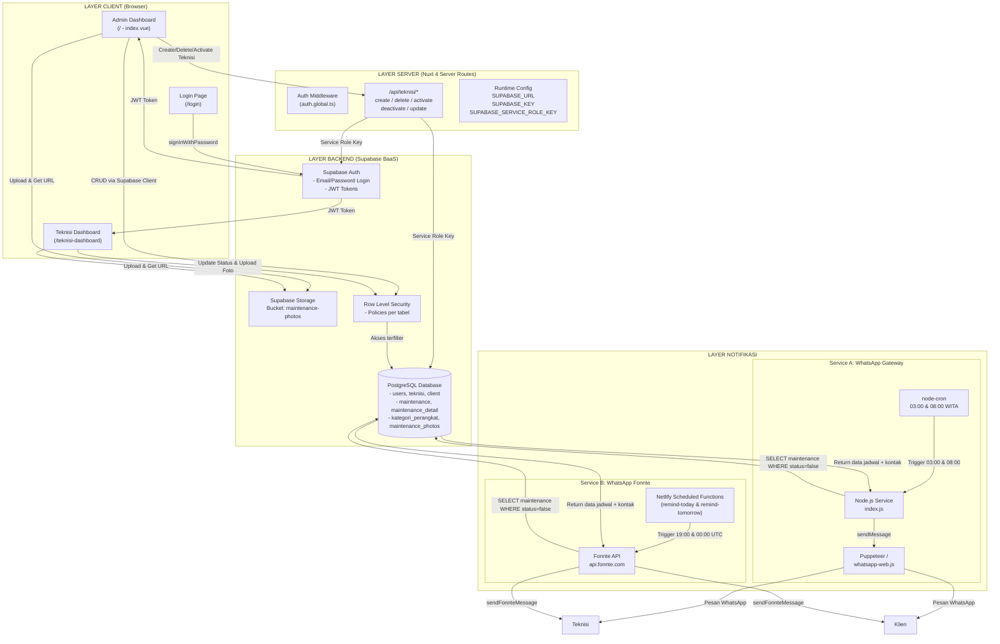
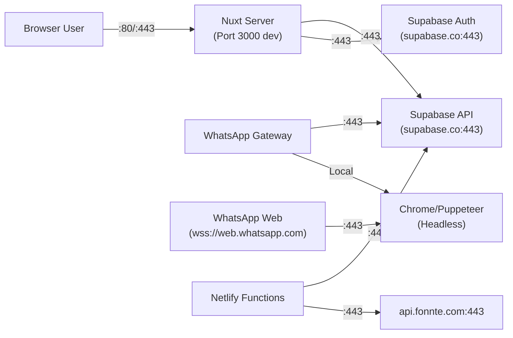

# Bab 1: Arsitektur Sistem

## 1.1 Gambaran Umum

**MaintenApp** adalah aplikasi *maintenance management system* berbasis web yang memungkinkan admin menjadwalkan, memantau, dan mengelola tugas pemeliharaan perangkat, serta memberikan notifikasi otomatis melalui WhatsApp kepada teknisi dan klien.

Aplikasi ini menggunakan arsitektur **decoupled (terpisah)** dengan tiga komponen utama yang berjalan secara independen:

1. **Dashboard Web (Nuxt.js 4)** — Frontend + Backend API ringan (server routes)
2. **WhatsApp Gateway (Node.js)** — Layanan pengingat otomatis via WhatsApp menggunakan whatsapp-web.js
3. **WhatsApp Fonnte (Netlify Functions)** — Layanan pengingat alternatif via API Fonnte

Ketiga komponen tersebut terhubung ke satu basis data bersama di **Supabase (PostgreSQL)**.

---

## 1.2 Diagram Arsitektur



---

## 1.3 Teknologi yang Digunakan

### 1.3.1 Dashboard (Nuxt 4)

| Teknologi | Versi | Fungsi |
|-----------|-------|--------|
| **Nuxt.js** | ^4.4.2 | Framework Vue.js full-stack untuk SSR/SPA |
| **Vue 3** | ^3.5.32 | Reactive UI framework |
| **Nuxt UI** | ^4.6.1 | Library komponen UI siap pakai |
| **Tailwind CSS** | ^4.2.2 | Utility-first CSS framework |
| **@nuxtjs/supabase** | ^2.0.5 | Modul integrasi Nuxt dengan Supabase |
| **Supabase JS Client** | (via modul) | Client library untuk akses database & auth |
| **Vue Router** | ^5.0.4 | Routing SPA |
| **Vitest** | ^4.1.9 | Unit testing framework |
| **@nuxt/test-utils** | ^4.0.3 | Testing utilities untuk Nuxt |

### 1.3.2 WhatsApp Gateway (Node.js Service)

| Teknologi | Versi | Fungsi |
|-----------|-------|--------|
| **Node.js** | (runtime) | JavaScript runtime |
| **whatsapp-web.js** | ^1.34.2 | Library integrasi WhatsApp Web |
| **Puppeteer** | (bawaan WA-JS) | Headless browser untuk WhatsApp Web |
| **node-cron** | ^4.2.1 | Penjadwalan tugas otomatis |
| **Supabase JS Client** | ^2.103.3 | Client database |
| **qrcode-terminal** | ^0.12.0 | Generate QR code di terminal |
| **dotenv** | ^17.4.2 | Load environment variables |

### 1.3.3 WhatsApp Fonnte (Netlify Functions)

| Teknologi | Versi | Fungsi |
|-----------|-------|--------|
| **Netlify Functions** | (serverless) | Hosting serverless function |
| **@netlify/functions** | ^2.6.0 | SDK untuk scheduled functions |
| **@supabase/supabase-js** | ^2.43.0 | Client database |
| **axios** | ^1.7.0 | HTTP client untuk Fonnte API |
| **Fonnte API** | (eksternal) | WhatsApp gateway pihak ketiga |

### 1.3.4 Backend & Infrastruktur

| Teknologi | Fungsi |
|-----------|--------|
| **Supabase** | Backend-as-a-Service (BaaS) |
| **PostgreSQL** | Database relasional |
| **Supabase Auth** | Autentikasi (email/password) |
| **Supabase Storage** | Penyimpanan file/gambar |
| **Supabase RLS** | Row Level Security |
| **Netlify** | Hosting serverless functions & scheduler |

---

## 1.4 Struktur Direktori

```
TugasAkhir/
├── @Docs/                          # Dokumentasi teknis
├── Dashboard/                      # Aplikasi Nuxt.js utama
│   ├── app/
│   │   ├── app.vue                 # Root component
│   │   ├── layouts/
│   │   │   └── default.vue         # Layout sidebar + navbar
│   │   ├── middleware/
│   │   │   └── auth.global.ts      # Global auth middleware
│   │   ├── pages/
│   │   │   ├── index.vue           # Admin Dashboard (CRUD maintenance)
│   │   │   ├── login.vue           # Halaman login
│   │   │   ├── client.vue          # Manajemen client
│   │   │   ├── teknisi.vue         # Manajemen teknisi
│   │   │   ├── teknisi-dashboard.vue # Dashboard teknisi
│   │   │   └── unauthorized.vue    # Halaman akses ditolak
│   │   └── assets/css/main.css     # Global styles
│   ├── server/api/teknisi/         # Server routes (backend API)
│   │   ├── create.post.ts
│   │   ├── delete.delete.ts
│   │   ├── activate.post.ts
│   │   ├── deactivate.post.ts
│   │   └── update.post.ts
│   ├── nuxt.config.ts              # Konfigurasi Nuxt
│   ├── tailwind.config.js          # Konfigurasi Tailwind CSS
│   ├── create_user.js              # Script pembuatan user (CLI)
│   └── check_users.js              # Script cek user (CLI)
│
├── WhatsappGateway/                # Service pengingat (Puppeteer)
│   ├── index.js                    # Entry point + cron jobs
│   ├── supabase.js                 # Koneksi Supabase
│   └── package.json
│
├── WhatsappFonnte/                 # Service pengingat (Netlify + Fonnte)
│   ├── netlify/functions/
│   │   ├── remind-today.js         # Scheduled function (H+0)
│   │   └── remind-tomorrow.js      # Scheduled function (H+1)
│   └── utils/
│       ├── supabase.js             # Koneksi Supabase
│       └── fonnte.js               # Client API Fonnte
│
├── DATABASE_SCHEMA.md              # Skema database (referensi awal)
└── README.md                       # Panduan operasional (diperbarui)
```

---

## 1.5 Pola Arsitektur: Decoupled Services

Ketiga komponen (**Dashboard**, **WhatsApp Gateway**, **WhatsApp Fonnte**) berjalan secara independen dan hanya terhubung melalui database Supabase yang sama. Pola ini memberikan keuntungan:

1. **Isolasi Kegagalan** — Jika WhatsApp Gateway mati, dashboard tetap berfungsi, dan sebaliknya.
2. **Skalabilitas Independen** — Setiap service bisa di-scale sendiri tanpa memengaruhi yang lain.
3. **Deployment Terpisah** — Dashboard di-deploy sebagai Nuxt app, Gateway sebagai Node.js service mandiri, Fonnte sebagai Netlify Functions.
4. **Redundansi Notifikasi** — Dua service notifikasi (Gateway & Fonnte) menyediakan *fallback* jika salah satu gagal.

### Tabel Pembagian Tanggung Jawab

| Komponen | Tugas Utama | Metode Komunikasi | Deployment |
|----------|-------------|-------------------|------------|
| **Dashboard** | UI manajemen maintenance, upload foto, manajemen teknisi/client | Supabase Client langsung + Server Routes | Nuxt (VPS/Cloudflare/Node) |
| **WhatsApp Gateway** | Kirim pengingat via WhatsApp Web (Puppeteer) | Supabase Client (read-only) + whatsapp-web.js | VPS/VM (butuh Chrome) |
| **WhatsApp Fonnte** | Kirim pengingat via API Fonnte | Supabase Client (read-only) + HTTP ke Fonnte | Netlify (serverless) |

---

## 1.6 Alur Jaringan dan Port



---

## 1.7 Pertimbangan Arsitektur

| Aspek | Detail |
|-------|--------|
| **State Management** | `useState()` Nuxt untuk role & search query; Supabase Realtime belum digunakan |
| **Autentikasi** | Supabase Auth dengan JWT; middleware global untuk proteksi rute |
| **Database Access** | Client-side via anon key + RLS; Server-side via service_role key (bypass RLS) |
| **File Storage** | Supabase Storage bucket `maintenance-photos` untuk bukti foto |
| **Scheduling** | node-cron (Gateway) dan Netlify Scheduled Functions (Fonnte) |
| **Format Nomor WA** | Normalisasi nomor Indonesia: `08xxx` → `628xxx@c.us` |