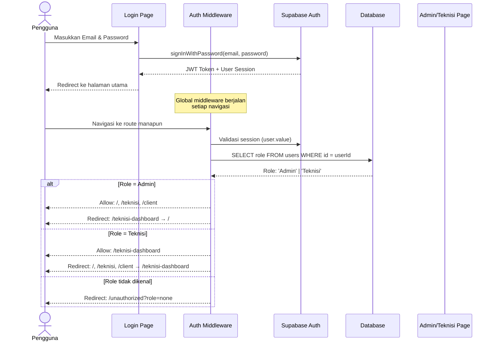
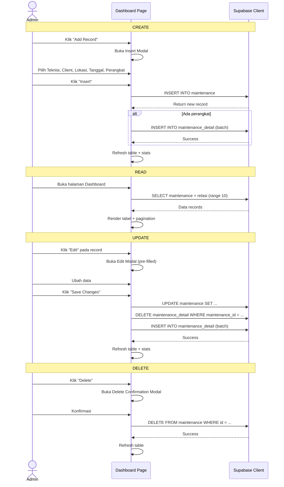
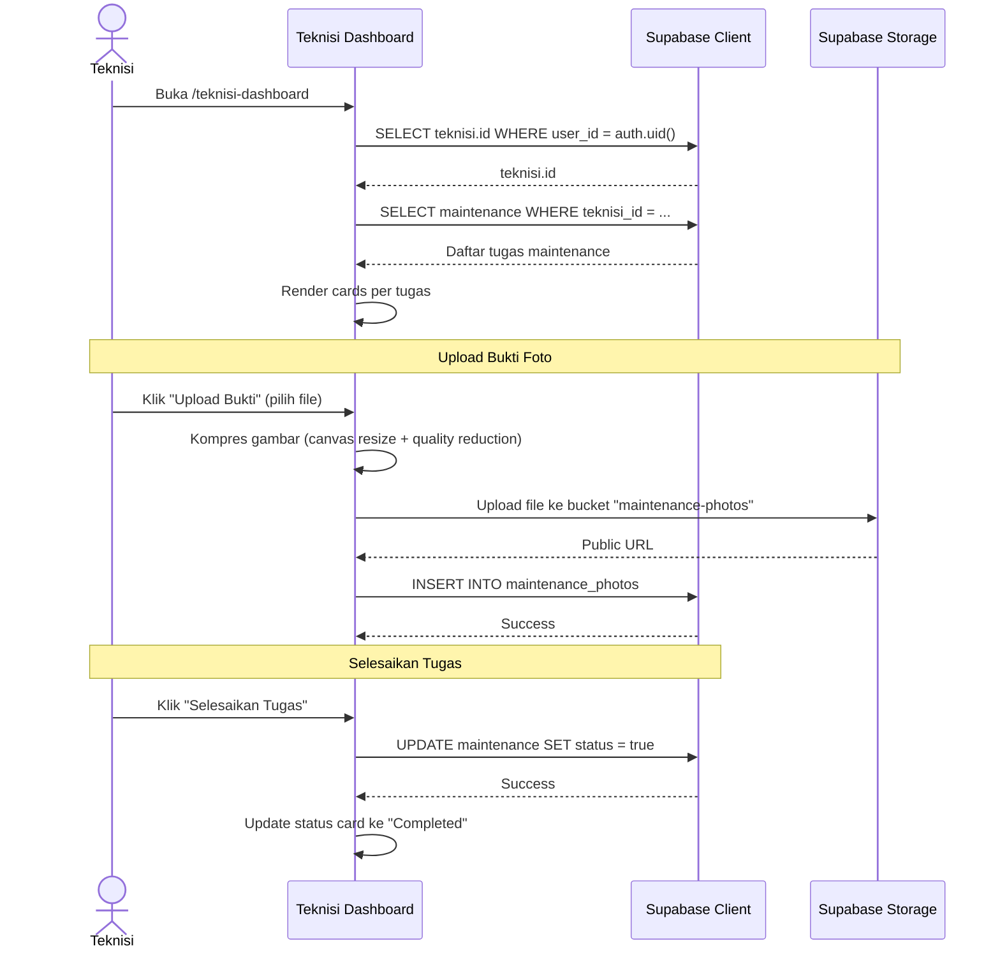
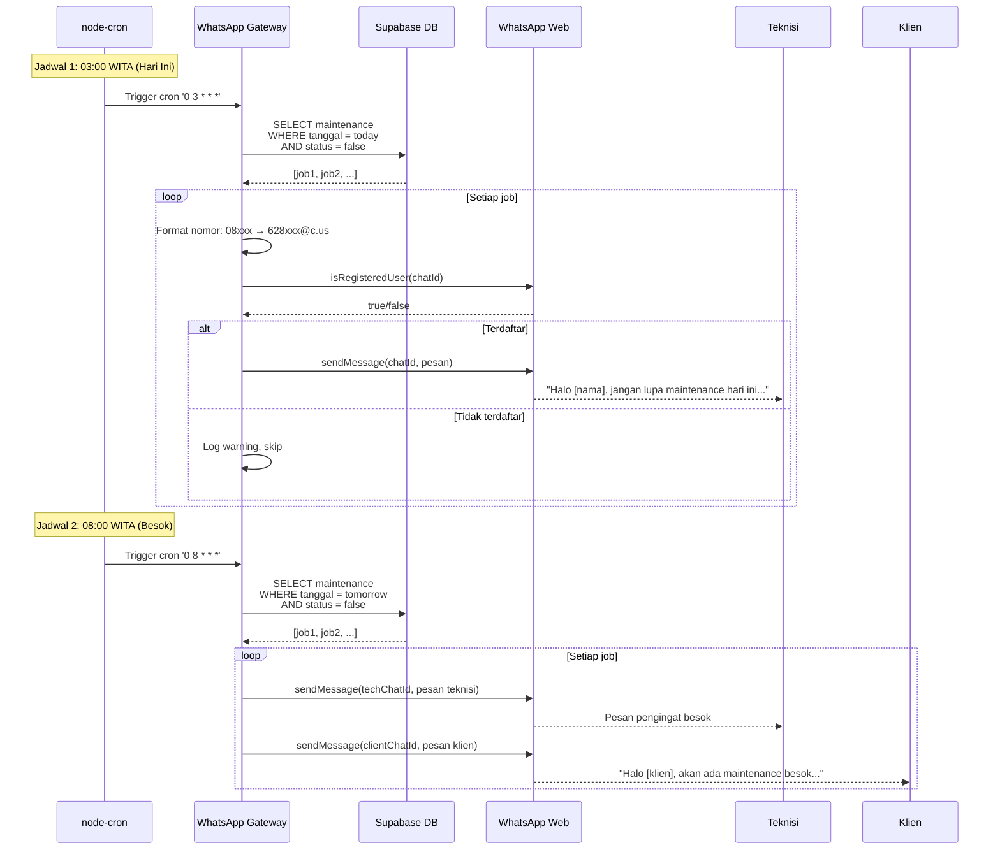
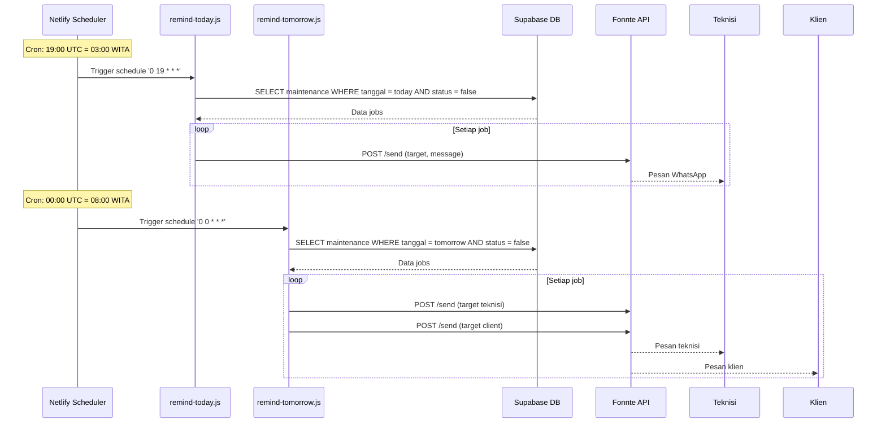
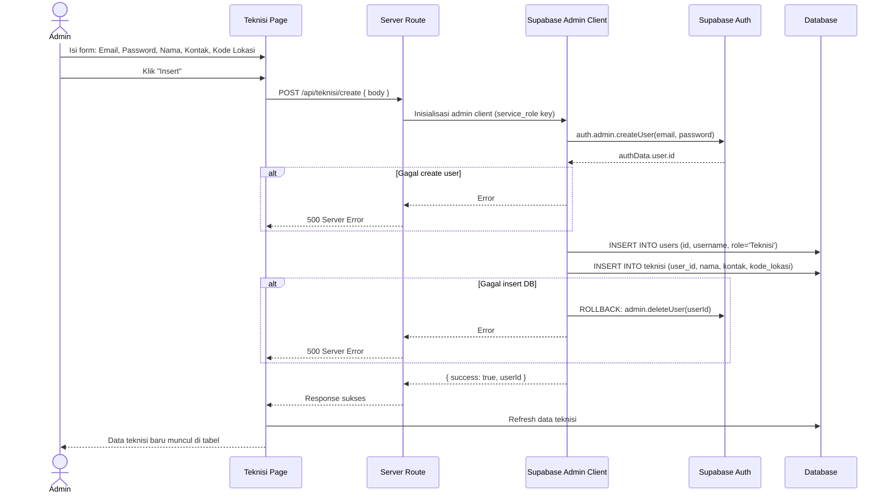
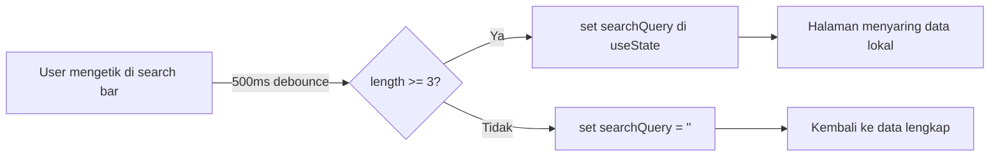

# Bab 2: Cara Kerja Sistem (Flow & Logic)

## 2.1 Alur Autentikasi

### 2.1.1 Diagram Alur Login



### 2.1.2 Detail Auth Middleware

File: `app/middleware/auth.global.ts`

Middleware ini berjalan **global** (setiap navigasi) dan melakukan:

1. **Cek Session** — Memeriksa apakah `useSupabaseUser()` memiliki nilai valid (`id` atau `sub`)
2. **Fetch Role** — Jika role belum di-cache di `useState('user-role')`, query tabel `users` untuk mendapatkan role
3. **Route Protection** — Berdasarkan role yang ditemukan:
   - **Admin**: Akses ke `/`, `/teknisi`, `/client`; dilarang ke `/teknisi-dashboard`
   - **Teknisi**: Hanya akses ke `/teknisi-dashboard`; semua route lain dialihkan
   - **Unknown**: Dialihkan ke `/unauthorized`

**Catatan penting:** Role di-cache di `useState('user-role')` selama session, sehingga hanya perlu 1 kali query database.

---

## 2.2 Alur Manajemen Maintenance (Admin)

### 2.2.1 CRUD Maintenance



### 2.2.2 Optimasi Query yang Diterapkan

Berdasarkan analisis kode `index.vue`, beberapa optimasi telah diterapkan:

1. **Server-side Pagination** — Data difetch per halaman (10 record) dengan `.range()` untuk menghindari *overfetching*
2. **Dropdown Data Caching** — Data teknisi, client, kategori_perangkat di-cache setelah fetch pertama (`dropdownDataLoaded` flag)
3. **Parallel Fetching** — `getMaintenanceData()` dan `fetchStats()` dijalankan paralel dengan `Promise.all()`
4. **Exact Count** — Statistik menggunakan `{ count: 'exact', head: true }` untuk menghindari *full-table scan* yang mahal
5. **Client-side Search Fallback** — Pencarian dilakukan client-side jika data sudah di-fetch (cocok untuk dataset kecil)

---

## 2.3 Alur Dashboard Teknisi



### 2.3.1 Kompresi Gambar (Client-side)

File: `teknisi-dashboard.vue` — Fungsi `compressImage()`

Untuk menghemat bandwidth dan storage, gambar dikompresi langsung di browser sebelum diunggah:

1. **Resize** — Maksimum dimensi 1920×1080 (mempertahankan aspek rasio)
2. **Kualitas** — Dimulai dari 80%, diturunkan bertahap hingga gambar ≤ 500KB
3. **Format** — Output selalu JPEG (`image/jpeg`)
4. **Validasi** — Tipe file: `image/jpeg`, `image/png`, `image/webp`; Maksimum 5MB sebelum kompresi

---

## 2.4 Alur Notifikasi Otomatis

Sistem memiliki **dua service notifikasi independen** yang berjalan secara paralel.

### 2.4.1 Service A: WhatsApp Gateway (Node.js + Puppeteer)



### 2.4.2 Service B: WhatsApp Fonnte (Netlify Scheduled Functions)



### 2.4.3 Perbandingan Service Notifikasi

| Aspek | WhatsApp Gateway | WhatsApp Fonnte |
|-------|-----------------|-----------------|
| **Metode** | whatsapp-web.js (Puppeteer) | API Fonnte (third-party) |
| **Keunggulan** | Gratis, tidak perlu API key | Lebih stabil, tidak tergantung browser |
| **Kelemahan** | Perlu maintain session WA, berat (Chrome) | Bergantung pada service eksternal |
| **Hosting** | VPS / VM dengan Chrome | Netlify (serverless) |
| **Validasi Nomor** | `isRegisteredUser()` | Tidak ada (Fonnte handle) |
| **Autentikasi** | QR Code scan | Token API (`FONNTE_TOKEN`) |

---

## 2.5 Alur Manajemen Teknisi (Admin)

### 2.5.1 Pembuatan Teknisi Baru

File: `server/api/teknisi/create.post.ts`

Pembuatan teknisi membutuhkan **Service Role Key** karena harus membuat user di Supabase Auth (operasi admin).



### 2.5.2 Aktivasi / Deaktivasi Teknisi

Fungsi aktivasi/deaktivasi hanya mengubah kolom `is_active` di tabel `users`. Teknisi yang dinonaktifkan tetap bisa login, tetapi statusnya akan terlihat di dashboard admin.

```
Deaktivasi: UPDATE users SET is_active = false WHERE id = :userId
Aktivasi:   UPDATE users SET is_active = true WHERE id = :userId
Penghapusan: DELETE user dari Auth, users, dan teknisi (cascade)
```

---

## 2.6 Alur Pencarian (Search)

Pencarian di sidebar bekerja dengan **debounce 500ms** dan **shared state**:



Search query menggunakan `useState('search-query')` sehingga state dibagikan antar halaman. Setiap halaman (index, client, teknisi) melakukan filtering client-side pada data yang sudah di-fetch.