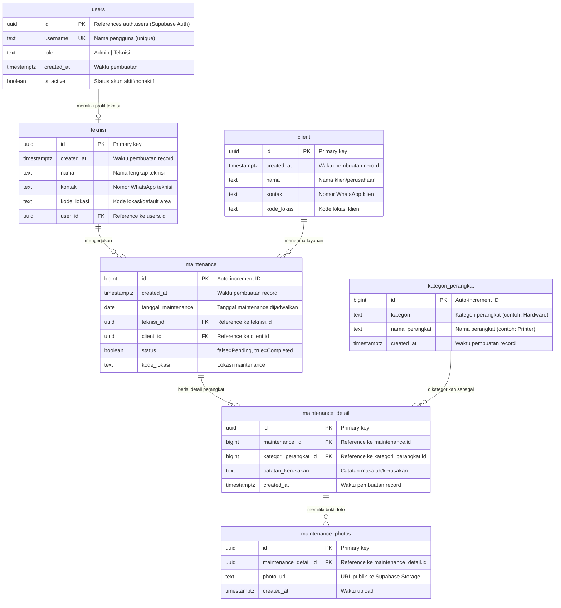

# Bab 3: Skema Database

## 3.1 Entity Relationship Diagram (ERD)



---

## 3.2 Detail Tabel

### 3.2.1 `users`

Tabel yang terintegrasi dengan **Supabase Auth**. Setiap user di `auth.users` harus memiliki record yang sesuai di tabel ini.

| Kolom | Tipe | Constraint | Deskripsi |
|-------|------|-----------|-----------|
| `id` | `uuid` | `PRIMARY KEY` | ID dari `auth.users` (sinkron dengan Auth) |
| `username` | `text` | `UNIQUE NOT NULL` | Username (biasanya diambil dari email) |
| `role` | `text` | `CHECK (role IN ('Admin', 'Teknisi'))` | Role pengguna |
| `created_at` | `timestamptz` | `DEFAULT now()` | Timestamp pembuatan |
| `is_active` | `boolean` | `DEFAULT true` | Status aktif akun |

**Indeks:**
- `users_pkey` pada `id`
- `users_username_key` unique pada `username`

### 3.2.2 `teknisi`

Menyimpan data profil teknisi.

| Kolom | Tipe | Constraint | Deskripsi |
|-------|------|-----------|-----------|
| `id` | `uuid` | `PRIMARY KEY DEFAULT gen_random_uuid()` | ID unik teknisi |
| `created_at` | `timestamptz` | `DEFAULT now()` | Timestamp |
| `nama` | `text` | `NOT NULL` | Nama lengkap |
| `kontak` | `text` | | Nomor WhatsApp |
| `kode_lokasi` | `text` | | Kode area/lokasi |
| `user_id` | `uuid` | `FOREIGN KEY REFERENCES users(id) ON DELETE CASCADE` | Link ke tabel users |

**Indeks:**
- `teknisi_pkey` pada `id`
- `teknisi_user_id_key` unique pada `user_id` (one-to-one dengan users)
- Indeks pada `user_id` untuk lookup cepat

### 3.2.3 `client`

Menyimpan data klien atau pelanggan.

| Kolom | Tipe | Constraint | Deskripsi |
|-------|------|-----------|-----------|
| `id` | `uuid` | `PRIMARY KEY DEFAULT gen_random_uuid()` | ID unik client |
| `created_at` | `timestamptz` | `DEFAULT now()` | Timestamp |
| `nama` | `text` | `NOT NULL` | Nama client/perusahaan |
| `kontak` | `text` | | Nomor WhatsApp |
| `kode_lokasi` | `text` | | Kode lokasi |

### 3.2.4 `kategori_perangkat`

Daftar kategori dan jenis perangkat yang bisa di-maintenance.

| Kolom | Tipe | Constraint | Deskripsi |
|-------|------|-----------|-----------|
| `id` | `bigint` | `PRIMARY KEY GENERATED ALWAYS AS IDENTITY` | ID auto-increment |
| `kategori` | `text` | `NOT NULL` | Kategori (contoh: Hardware, Jaringan) |
| `nama_perangkat` | `text` | `NOT NULL` | Nama perangkat (contoh: Printer, Router) |
| `created_at` | `timestamptz` | `DEFAULT now()` | Timestamp |

### 3.2.5 `maintenance`

Tabel utama yang mencatat jadwal maintenance.

| Kolom | Tipe | Constraint | Deskripsi |
|-------|------|-----------|-----------|
| `id` | `bigint` | `PRIMARY KEY GENERATED ALWAYS AS IDENTITY` | ID auto-increment |
| `created_at` | `timestamptz` | `DEFAULT now()` | Timestamp |
| `tanggal_maintenance` | `date` | `NOT NULL` | Tanggal maintenance |
| `teknisi_id` | `uuid` | `FOREIGN KEY REFERENCES teknisi(id)` | Teknisi yang ditugaskan |
| `client_id` | `uuid` | `FOREIGN KEY REFERENCES client(id)` | Klien penerima layanan |
| `status` | `boolean` | `DEFAULT false` | Status: false = Pending, true = Completed |
| `kode_lokasi` | `text` | `NOT NULL` | Lokasi maintenance |

**Indeks yang disarankan:**
- `maintenance_pkey` pada `id`
- Indeks pada `teknisi_id` (untuk query dashboard teknisi)
- Indeks pada `tanggal_maintenance` (untuk query notifikasi)
- Indeks komposit pada `(tanggal_maintenance, status)` (optimasi query notifikasi)

### 3.2.6 `maintenance_detail`

Detail perangkat yang diperiksa dalam satu sesi maintenance.

| Kolom | Tipe | Constraint | Deskripsi |
|-------|------|-----------|-----------|
| `id` | `uuid` | `PRIMARY KEY DEFAULT gen_random_uuid()` | ID unik |
| `maintenance_id` | `bigint` | `FOREIGN KEY REFERENCES maintenance(id) ON DELETE CASCADE` | Induk maintenance |
| `kategori_perangkat_id` | `bigint` | `FOREIGN KEY REFERENCES kategori_perangkat(id)` | Perangkat yang diperiksa |
| `catatan_kerusakan` | `text` | | Catatan masalah |
| `created_at` | `timestamptz` | `DEFAULT now()` | Timestamp |

**Indeks:**
- `maintenance_detail_pkey` pada `id`
- Indeks pada `maintenance_id` (query detail untuk satu maintenance)

### 3.2.7 `maintenance_photos`

Bukti foto dokumentasi maintenance.

| Kolom | Tipe | Constraint | Deskripsi |
|-------|------|-----------|-----------|
| `id` | `uuid` | `PRIMARY KEY DEFAULT gen_random_uuid()` | ID unik |
| `maintenance_detail_id` | `uuid` | `FOREIGN KEY REFERENCES maintenance_detail(id) ON DELETE CASCADE` | Detail perangkat terkait |
| `photo_url` | `text` | `NOT NULL` | URL publik ke Supabase Storage |
| `created_at` | `timestamptz` | `DEFAULT now()` | Timestamp |

**Indeks:**
- `maintenance_photos_pkey` pada `id`
- Indeks pada `maintenance_detail_id` (query foto untuk suatu detail)

---

## 3.3 Relasi Antar Tabel

| Relasi | Tipe | Source | Target | Field Kunci |
|--------|------|--------|--------|-------------|
| User → Teknisi | One-to-One | `users.id` | `teknisi.user_id` | Seorang user (role=Teknisi) memiliki satu profil teknisi |
| Teknisi → Maintenance | One-to-Many | `teknisi.id` | `maintenance.teknisi_id` | Satu teknisi bisa menangani banyak maintenance |
| Client → Maintenance | One-to-Many | `client.id` | `maintenance.client_id` | Satu client bisa memiliki banyak maintenance |
| Maintenance → Detail | One-to-Many | `maintenance.id` | `maintenance_detail.maintenance_id` | Satu maintenance bisa memiliki banyak detail perangkat |
| Kategori → Detail | One-to-Many | `kategori_perangkat.id` | `maintenance_detail.kategori_perangkat_id` | Satu kategori bisa muncul di banyak detail |
| Detail → Photos | One-to-Many | `maintenance_detail.id` | `maintenance_photos.maintenance_detail_id` | Satu detail bisa memiliki banyak foto |

---

## 3.4 SQL DDL (Ringkasan)

Berikut adalah DDL untuk membuat tabel-tabel di atas di Supabase SQL Editor:

```sql
-- 1. USERS (terintegrasi dengan auth.users via trigger)
CREATE TABLE public.users (
  id UUID PRIMARY KEY REFERENCES auth.users(id) ON DELETE CASCADE,
  username TEXT UNIQUE NOT NULL,
  role TEXT NOT NULL CHECK (role IN ('Admin', 'Teknisi')),
  created_at TIMESTAMPTZ DEFAULT now(),
  is_active BOOLEAN DEFAULT true
);

-- Trigger untuk auto-create user di public.users saat signup
-- (Bisa dibuat manual atau via Supabase Trigger)

-- 2. TEKNISI
CREATE TABLE public.teknisi (
  id UUID PRIMARY KEY DEFAULT gen_random_uuid(),
  created_at TIMESTAMPTZ DEFAULT now(),
  nama TEXT NOT NULL,
  kontak TEXT,
  kode_lokasi TEXT,
  user_id UUID UNIQUE REFERENCES public.users(id) ON DELETE CASCADE
);

-- 3. CLIENT
CREATE TABLE public.client (
  id UUID PRIMARY KEY DEFAULT gen_random_uuid(),
  created_at TIMESTAMPTZ DEFAULT now(),
  nama TEXT NOT NULL,
  kontak TEXT,
  kode_lokasi TEXT
);

-- 4. KATEGORI_PERANGKAT
CREATE TABLE public.kategori_perangkat (
  id BIGINT PRIMARY KEY GENERATED ALWAYS AS IDENTITY,
  kategori TEXT NOT NULL,
  nama_perangkat TEXT NOT NULL,
  created_at TIMESTAMPTZ DEFAULT now()
);

-- 5. MAINTENANCE
CREATE TABLE public.maintenance (
  id BIGINT PRIMARY KEY GENERATED ALWAYS AS IDENTITY,
  created_at TIMESTAMPTZ DEFAULT now(),
  tanggal_maintenance DATE NOT NULL,
  teknisi_id UUID REFERENCES public.teknisi(id),
  client_id UUID REFERENCES public.client(id),
  status BOOLEAN DEFAULT false,
  kode_lokasi TEXT NOT NULL
);

CREATE INDEX idx_maintenance_teknisi_id ON public.maintenance(teknisi_id);
CREATE INDEX idx_maintenance_tanggal ON public.maintenance(tanggal_maintenance);
CREATE INDEX idx_maintenance_tanggal_status ON public.maintenance(tanggal_maintenance, status);

-- 6. MAINTENANCE_DETAIL
CREATE TABLE public.maintenance_detail (
  id UUID PRIMARY KEY DEFAULT gen_random_uuid(),
  maintenance_id BIGINT NOT NULL REFERENCES public.maintenance(id) ON DELETE CASCADE,
  kategori_perangkat_id BIGINT NOT NULL REFERENCES public.kategori_perangkat(id),
  catatan_kerusakan TEXT,
  created_at TIMESTAMPTZ DEFAULT now()
);

CREATE INDEX idx_maintenance_detail_mt_id ON public.maintenance_detail(maintenance_id);

-- 7. MAINTENANCE_PHOTOS
CREATE TABLE public.maintenance_photos (
  id UUID PRIMARY KEY DEFAULT gen_random_uuid(),
  maintenance_detail_id UUID NOT NULL REFERENCES public.maintenance_detail(id) ON DELETE CASCADE,
  photo_url TEXT NOT NULL,
  created_at TIMESTAMPTZ DEFAULT now()
);

CREATE INDEX idx_maintenance_photos_detail_id ON public.maintenance_photos(maintenance_detail_id);
```

---

## 3.5 Ringkasan Tipe Data

| Tipe Data | Penggunaan |
|-----------|-----------|
| `uuid` | Primary key untuk tabel utama (`users`, `teknisi`, `client`, `maintenance_detail`, `maintenance_photos`) |
| `bigint` | Auto-increment ID (`maintenance`, `kategori_perangkat`) |
| `text` | String untuk nama, kontak, kode_lokasi, URL, catatan |
| `boolean` | Status (`is_active`, `status`) |
| `date` | Tanggal maintenance (`tanggal_maintenance`) |
| `timestamptz` | Timestamp dengan timezone untuk auditing (`created_at`) |

---

## 3.6 Catatan Penting

1. **ON DELETE CASCADE** — Penghapusan user akan otomatis menghapus data teknisi terkait, demikian juga maintenance → detail → photos
2. **gen_random_uuid()** — UUID v4 di-generate otomatis oleh PostgreSQL
3. **GENERATED ALWAYS AS IDENTITY** — Auto-increment untuk kolom bigint (pengganti `SERIAL`)
4. **Trigger Auth** — Supabase dapat dikonfigurasi untuk auto-insert user ke `public.users` saat signup melalui trigger pada `auth.users`