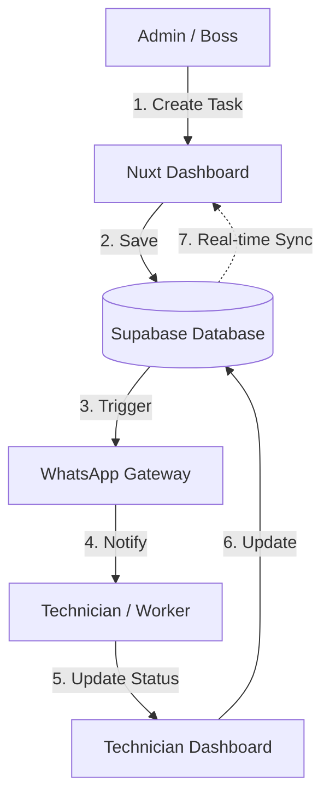
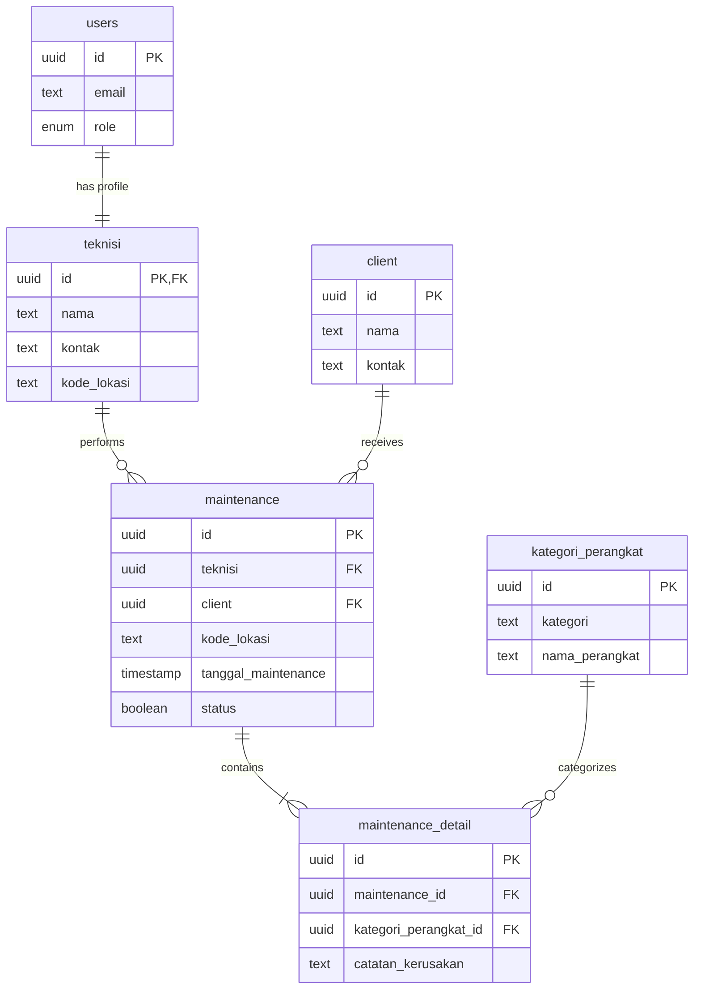

# 🚀 MaintenApp - Technical Documentation

This document provides a technical overview of the **MaintenApp** project, intended for developers looking to understand the architecture, data model, and workflows.

---

## 🛠 Tech Stack

- **Frontend Framework:** [Nuxt.js](https://nuxt.com/) (Vue.js)
- **Backend-as-a-Service (BaaS):** [Supabase](https://supabase.com/)
 - **Database:** PostgreSQL
 - **Authentication:** Supabase Auth
 - **Realtime:** Supabase Realtime (Postgres Changes)
 - **Storage:** Supabase Storage (for maintenance proof photos)
- **Notifications:** WhatsApp API Integration (via `WhatsappFonnte` or `WhatsappGateway`)
- **Styling:** Tailwind CSS & Nuxt UI

---

## 🏗 System Architecture

The application follows a modern, decoupled architecture:

1. **Client Layer (Nuxt.js):** A single-page application (SPA) that handles the UI for both Admins and Technicians. It interacts directly with Supabase via the Supabase Client SDK.
2. **Backend Layer (Supabase):** Acts as the central engine, handling database management, user authentication, file storage, and real-time data synchronization.
3. **Integration Layer (WhatsApp Gateway):** A service that listens for specific events (or is triggered by application logic) to send automated WhatsApp notifications to technicians and clients.

### High-Level Data Flow



---

## 🗄️ Database Schema (ERD Overview)

The database is relational and designed to support complex maintenance scheduling.

### Entity Relationship Diagram



### Core Tables Detail

#### `users`
Stores extended user profiles linked to Supabase Auth.
- `id` (UUID, PK): References `auth.users.id`.
- `email` (Text): User's email.
- `role` (Enum): `admin` or `teknisi`.

#### `teknisi`
Profiles for technicians.
- `id` (UUID, PK): References `users.id`.
- `nama` (Text): Full name.
- `kontak` (Text): WhatsApp number.
- `kode_lokasi` (Text): Default working area.

#### `client`
Profiles for customers/companies.
- `id` (UUID, PK).
- `nama` (Text).
- `kontak` (Text): WhatsApp number.

#### `kategori_perangkat`
Lookup table for device types.
- `id` (UUID, PK).
- `kategori` (Text): e.g., "Hardware".
- `nama_perangkat` (Text): e.g., "Printer".

#### `maintenance`
The central transaction table for maintenance tasks.
- `id` (UUID, PK).
- `teknisi` (UUID, FK): References `teknisi.id`.
- `client` (UUID, FK): References `client.id`.
- `kode_lokasi` (Text).
- `tanggal_maintenance` (Timestamp).
- `status` (Boolean): `true` for Completed, `false` for Pending.

#### `maintenance_detail`
A child table of `maintenance` to support multiple devices per task (One-to-Many).
- `id` (UUID, PK).
- `maintenance_id` (UUID, FK): References `maintenance.id`.
- `kategori_perangkat_id` (UUID, FK): References `kategori_perangkat.id`.
- `catatan_kerusakan` (Text): Notes on the issue.

---

## 🔑 Key Implementation Details for Juniors

### 1. Real-time Subscriptions
To ensure the Admin dashboard stays up-to-date, we use Supabase Realtime. In Nuxt components, you will typically see:
```javascript
supabase
 .channel('maintenance-changes')
 .on('postgres_changes', { event: 'UPDATE', schema: 'public', table: 'maintenance' }, payload => {
 // Refresh data or update local state
 getMaintenanceData()
 })
 .subscribe()
```

### 2. Role-Based Access Control (RBAC)
Access is managed through a combination of:
- **Frontend:** Middleware (`auth.global.ts`) checks the user's role and redirects them to the appropriate dashboard (`index.vue` for Admin, `teknisi-dashboard.vue` for Technician).
- **Backend:** Supabase Row Level Security (RLS) policies should be used to ensure Technicians can only see/edit their assigned tasks, while Admins have full access.

### 3. WhatsApp Integration
The system relies on an external gateway. When a maintenance task is created or updated, the application logic (or a database trigger/edge function) sends a request to the WhatsApp API endpoint to dispatch the message.

---
*Generated for the MaintenApp Development Team.*