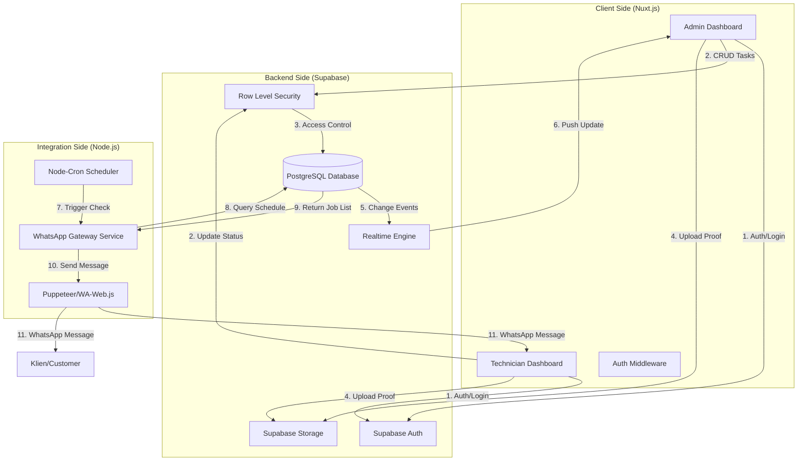
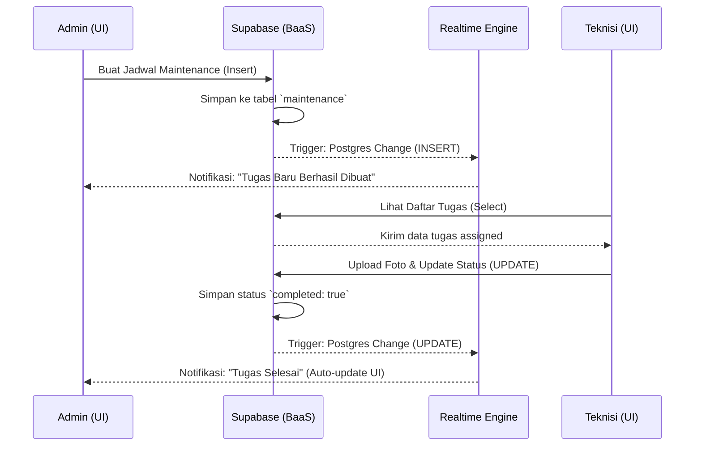
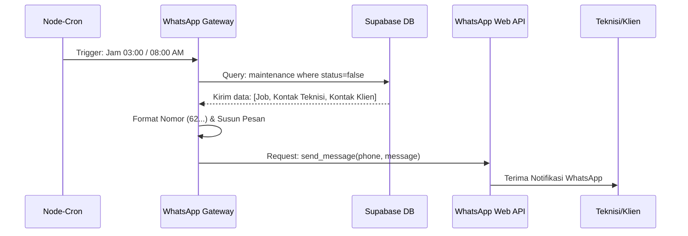
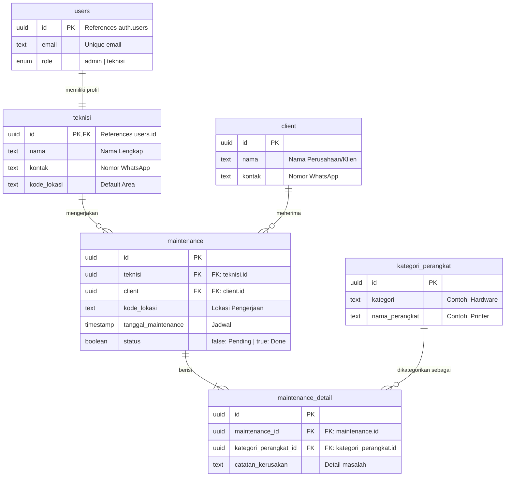

# 🚀 MaintenApp - Dokumentasi Teknis

Dokumen ini memberikan gambaran teknis dari proyek **MaintenApp**, yang dirancang untuk membantu pengembang (terutama junior) dalam memahami arsitektur, model data, dan alur kerja sistem.

---

## 🛠 Tech Stack (Teknologi yang Digunakan)

Kami menggunakan kombinasi teknologi modern untuk memastikan aplikasi cepat, responsif, dan mudah dikelola:

- **Frontend Framework:** [Nuxt.js](https://nuxt.com/) (Vue.js) — Digunakan untuk membangun antarmuka pengguna (UI) yang cepat.
- **Backend-as-a-Service (BaaS):** [Supabase](https://supabase.com/) — Mengelola infrastruktur backend tanpa perlu membuat server manual.
  - **Database:** PostgreSQL (Database relasional untuk menyimpan data).
  - **Authentication:** Supabase Auth (Sistem login dan keamanan pengguna).
  - **Realtime:** Supabase Realtime (Sinkronisasi data otomatis secara langsung).
  - **Storage:** Supabase Storage (Tempat menyimpan foto bukti pemeliharaan).
- **Notifikasi:** WhatsApp API Integration (Melalui `WhatsappGateway`) — Mengirim pengingat otomatis ke teknisi dan klien.
- **Styling:** Tailwind CSS & Nuxt UI — Untuk desain antarmuka yang konsisten dan modern.

---

## 🏗 Arsitektur Sistem (Detailed)

Aplikasi ini menggunakan arsitektur terpisah (*decoupled*) dengan pembagian tanggung jawab yang jelas antara UI, Database, dan Background Service.

### Diagram Arsitektur Detail


---

## 🔄 Alur Data (Detailed Data Flow)

Proses pengolahan data dalam MaintenApp terbagi menjadi dua aliran utama: Alur Pengelolaan Tugas dan Alur Notifikasi Otomatis.

### 1. Alur Pengelolaan Tugas (Task Management Flow)
Alur ini terjadi ketika Admin mengelola jadwal dan Teknisi mengupdate pengerjaan.



### 2. Alur Notifikasi Otomatis (Automatic Notification Flow)
Alur ini berjalan secara independen di latar belakang melalui Node.js.



---

## 🗄️ Skema Database (Detailed ERD)

Database dirancang secara relasional untuk menjamin integritas data (*Data Integrity*).

### Entity Relationship Diagram (ERD)


### Relasi Kunci
- **One-to-One (`users` $\rightarrow$ `teknisi`):** Setiap pengguna dengan role 'teknisi' memiliki satu profil detail teknisi.
- **One-to-Many (`maintenance` $\rightarrow$ `maintenance_detail`):** Satu sesi maintenance bisa mencakup pemeriksaan banyak perangkat sekaligus.
- **One-to-Many (`teknisi` $\rightarrow$ `maintenance`):** Seorang teknisi bisa menangani banyak tugas pemeliharaan.

---

## 🔑 Catatan Implementasi untuk Junior

### 1. Real-time Subscriptions (Supabase)
Agar UI terupdate otomatis tanpa refresh, gunakan `channel`. Ini sangat krusial untuk aplikasi dashboard.
```javascript
// Contoh listener untuk perubahan status maintenance
supabase
  .channel('maintenance-updates')
  .on('postgres_changes', { event: 'UPDATE', schema: 'public', table: 'maintenance' }, payload => {
    console.log('Data berubah!', payload.new)
    refreshUI() // Fungsi untuk update data di layar
  })
  .subscribe()
```

### 2. Keamanan dengan RLS (Row Level Security)
Kita tidak hanya mengamankan frontend, tapi juga backend. Supabase RLS memastikan:
- **Teknisi:** `SELECT` hanya jika `teknisi_id == auth.uid()`.
- **Admin:** `ALL` access ke semua baris data.

### 3. WhatsApp Gateway (Headless Browser)
WhatsApp Gateway menggunakan Puppeteer yang menjalankan Chrome di latar belakang untuk mensimulasikan WhatsApp Web.
- **Kelebihan:** Gratis (tidak bayar API resmi).
- **Kekurangan:** Perlu menjaga sesi login tetap aktif (Session persistence).

---
*Dokumentasi ini diperbarui untuk Tim Pengembangan MaintenApp.*
