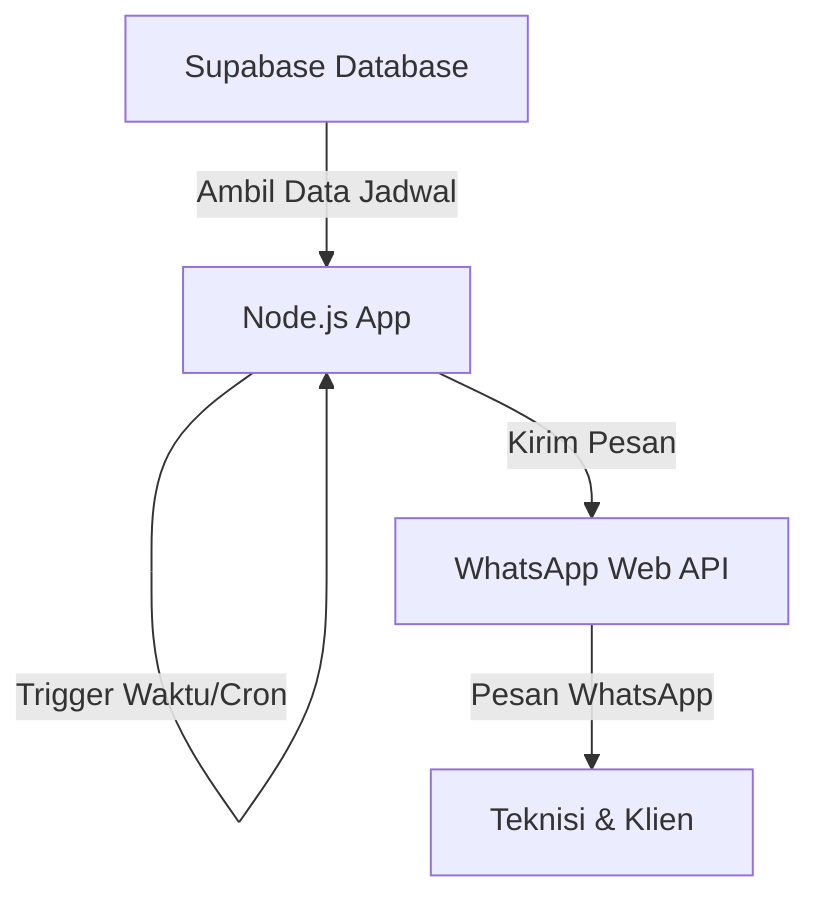
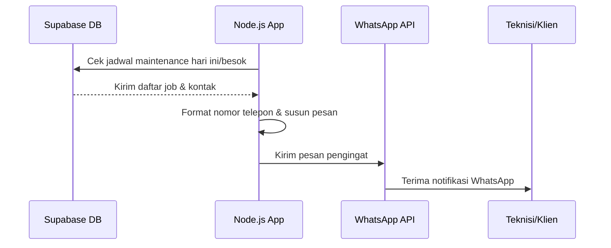
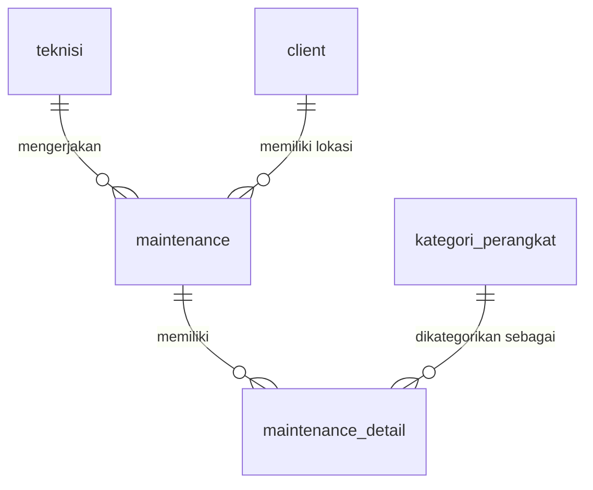

# 🚀 WhatsApp Gateway - Maintenance Reminder

Proyek ini adalah sistem pengingat otomatis berbasis WhatsApp yang digunakan untuk menginformasikan jadwal pemeliharaan (maintenance) perangkat kepada teknisi dan klien.

## 🛠️ Tech Stack
Sistem ini dibangun menggunakan teknologi berikut:
- **Node.js**: Runtime JavaScript untuk menjalankan aplikasi di sisi server.
- **whatsapp-web.js**: Library untuk mengintegrasikan fungsi WhatsApp melalui browser otomatis (Puppeteer).
- **Supabase**: Digunakan sebagai database (PostgreSQL) untuk menyimpan data teknisi, klien, lokasi, dan jadwal maintenance.
- **node-cron**: Library untuk mengatur jadwal pengiriman pesan otomatis (scheduling).

## 🏗️ Arsitektur Sistem
Sistem ini bekerja sebagai *background service* yang memantau database dan mengirimkan pesan secara otomatis pada waktu yang telah ditentukan.

## 🔄 Alur Data (Data Flow)
Berikut adalah alur kerja sederhana bagaimana sistem mengirimkan pengingat:

1. **Penjadwalan (Cron Job)**: Sistem memiliki jadwal otomatis setiap jam 03:00 AM (untuk hari ini) dan 08:00 AM (untuk besok).
2. **Pengambilan Data**: Aplikasi mengambil data dari tabel `maintenance` di Supabase yang statusnya belum selesai (`status: false`).
3. **Pemrosesan**: Sistem mencocokkan tanggal maintenance dengan tanggal hari ini atau besok, lalu mengambil data kontak teknisi dan klien.
4. **Pengiriman**: Nomor telepon diformat ke standar WhatsApp (`62... @c.us`), kemudian pesan dikirim melalui WhatsApp Gateway.

## 🗄️ Skema Database (Overview)
Database menggunakan struktur relasional sederhana untuk menghubungkan berbagai entitas:

- **teknisi**: Menyimpan data nama dan nomor kontak teknisi.
- **client**: Menyimpan data nama dan nomor kontak pelanggan.
- **maintenance**: Tabel utama yang mencatat kapan maintenance dilakukan, lokasi mana, siapa teknisinya, dan status pengerjaannya.
- **maintenance_detail**: Detail perangkat apa saja yang akan dikerjakan dalam satu sesi maintenance.
- **kategori_perangkat**: Daftar nama-nama perangkat (misal: AC, Router, Server).

