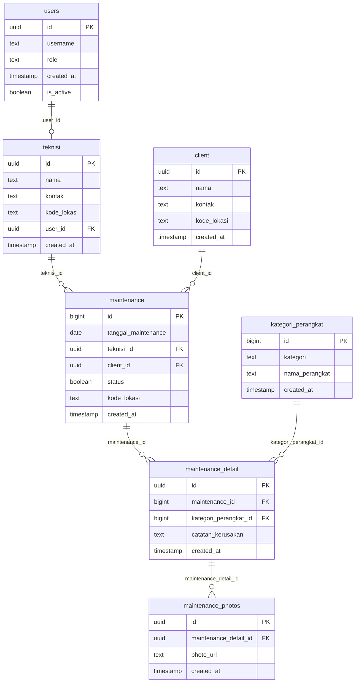

# Skema Database Supabase

Dokumen ini berisi informasi skema database terkini untuk proyek **DSComputerProject** di Supabase.

---

## Ringkasan Relasi (ERD Sederhana)
- **`users`** (1) <--- (0..1) **`teknisi`** (`user_id` -> `id`)
- **`teknisi`** (1) <--- (0..*) **`maintenance`** (`teknisi_id` -> `id`)
- **`client`** (1) <--- (0..*) **`maintenance`** (`client_id` -> `id`)
- **`maintenance`** (1) <--- (0..*) **`maintenance_detail`** (`maintenance_id` -> `id`)
- **`kategori_perangkat`** (1) <--- (0..*) **`maintenance_detail`** (`kategori_perangkat_id` -> `id`)
- **`maintenance_detail`** (1) <--- (0..*) **`maintenance_photos`** (`maintenance_detail_id` -> `id`)

### Diagram ERD

---

## Detail Tabel

### 1. `users`
Tabel untuk menyimpan data pengguna sistem dan kredensial/role dasar.

| Nama Kolom | Tipe Data | Nullable | Default | Keterangan |
| :--- | :--- | :--- | :--- | :--- |
| **`id`** 🔑 | `uuid` | NO | | Primary Key |
| `username` | `text` | NO | | |
| `role` | `text` | NO | | |
| `created_at` | `timestamp with time zone` | YES | `now()` | |
| `is_active` | `boolean` | YES | `true` | |

---

### 2. `teknisi`
Tabel informasi data teknisi.

| Nama Kolom | Tipe Data | Nullable | Default | Keterangan |
| :--- | :--- | :--- | :--- | :--- |
| **`id`** 🔑 | `uuid` | NO | `gen_random_uuid()` | Primary Key |
| `nama` | `text` | NO | | |
| `kontak` | `text` | NO | | |
| `kode_lokasi` | `text` | YES | | |
| `user_id` 🔗 | `uuid` | YES | | Foreign Key -> `users.id` |
| `created_at` | `timestamp with time zone` | NO | `now()` | |

---

### 3. `client`
Tabel data pelanggan/klien.

| Nama Kolom | Tipe Data | Nullable | Default | Keterangan |
| :--- | :--- | :--- | :--- | :--- |
| **`id`** 🔑 | `uuid` | NO | `gen_random_uuid()` | Primary Key |
| `nama` | `text` | NO | | |
| `kontak` | `text` | NO | | |
| `kode_lokasi` | `text` | YES | | |
| `created_at` | `timestamp with time zone` | NO | `now()` | |

---

### 4. `kategori_perangkat`
Tabel referensi kategori dan nama perangkat keras/lunak.

| Nama Kolom | Tipe Data | Nullable | Default | Keterangan |
| :--- | :--- | :--- | :--- | :--- |
| **`id`** 🔑 | `bigint` | NO | | Primary Key |
| `kategori` | `text` | NO | | |
| `nama_perangkat` | `text` | NO | | |
| `created_at` | `timestamp with time zone` | YES | `now()` | |

---

### 5. `maintenance`
Tabel transaksi utama untuk jadwal dan status kegiatan maintenance.

| Nama Kolom | Tipe Data | Nullable | Default | Keterangan |
| :--- | :--- | :--- | :--- | :--- |
| **`id`** 🔑 | `bigint` | NO | | Primary Key |
| `tanggal_maintenance` | `date` | NO | | |
| `teknisi_id` 🔗 | `uuid` | YES | | Foreign Key -> `teknisi.id` |
| `client_id` 🔗 | `uuid` | YES | | Foreign Key -> `client.id` |
| `status` | `boolean` | NO | `false` | Status pengerjaan (selesai/belum) |
| `kode_lokasi` | `text` | YES | | |
| `created_at` | `timestamp with time zone` | NO | `now()` | |

---

### 6. `maintenance_detail`
Detail teknis temuan kerusakan per perangkat saat maintenance.

| Nama Kolom | Tipe Data | Nullable | Default | Keterangan |
| :--- | :--- | :--- | :--- | :--- |
| **`id`** 🔑 | `uuid` | NO | `gen_random_uuid()` | Primary Key |
| `maintenance_id` 🔗 | `bigint` | NO | | Foreign Key -> `maintenance.id` |
| `kategori_perangkat_id` 🔗 | `bigint` | NO | | Foreign Key -> `kategori_perangkat.id` |
| `catatan_kerusakan` | `text` | YES | | Catatan temuan kerusakan |
| `created_at` | `timestamp with time zone` | YES | `now()` | |

---

### 7. `maintenance_photos`
Foto pendukung temuan kerusakan atau bukti pekerjaan maintenance.

| Nama Kolom | Tipe Data | Nullable | Default | Keterangan |
| :--- | :--- | :--- | :--- | :--- |
| **`id`** 🔑 | `uuid` | NO | `gen_random_uuid()` | Primary Key |
| `maintenance_detail_id` 🔗 | `uuid` | NO | | Foreign Key -> `maintenance_detail.id` |
| `photo_url` | `text` | NO | | URL file foto di storage |
| `created_at` | `timestamp with time zone` | YES | `now()` | |
